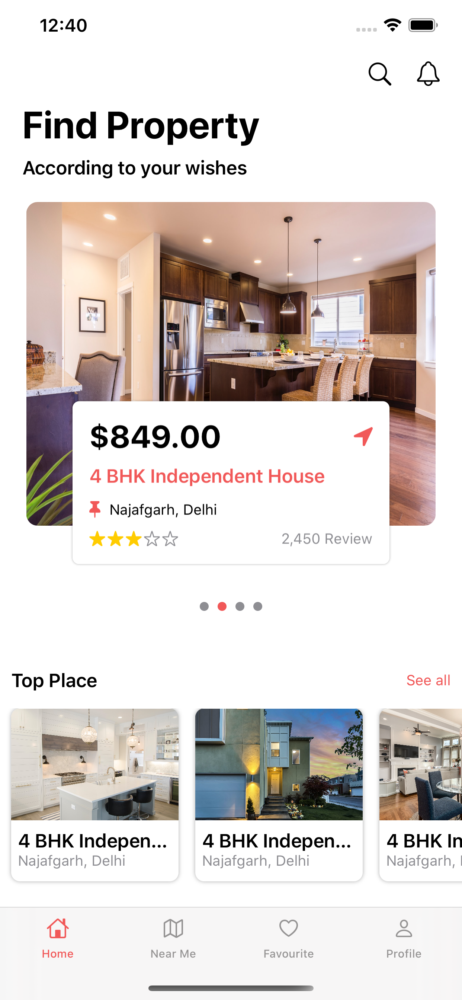
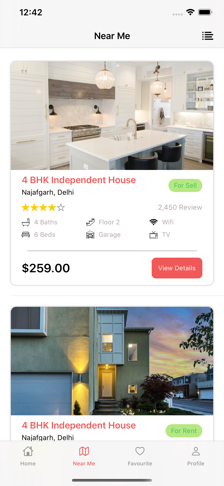
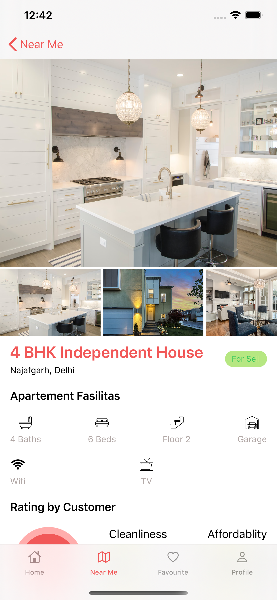
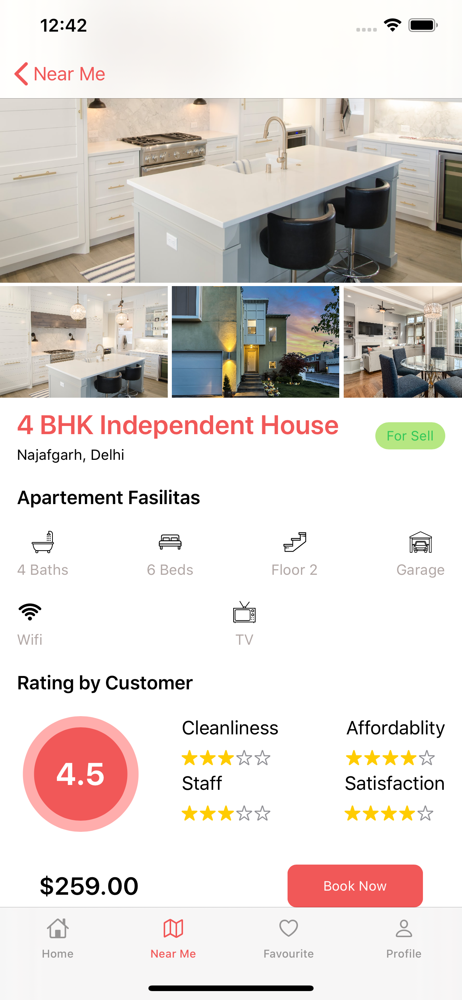

# property-marketplace
Clean &amp; Beautiful App design for real estate in SwiftUI

<h3>Screenshots</h3>
<h4>Homepage</h4>

<h4>Near Me/Favourite</h4>

<h4>Property Detail</h4>

<h2>Credits</h2>
<h3>Design Credit</h3>

https://dribbble.com/shots/5060124-Property-Marketplace/attachments/1124270

<h3>Icons</h3>

https://www.flaticon.com/

<h3>Images</h3>

https://unsplash.com/s/photos/real-estate

